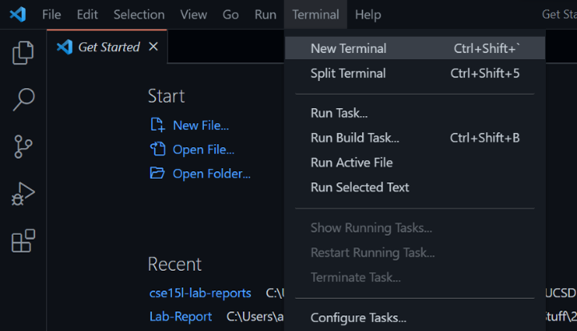
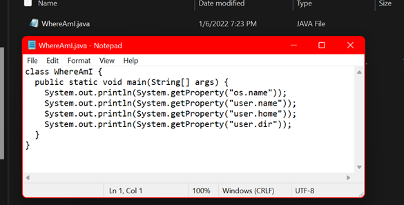

# Lab Report 1
## Using the remote UCSD servers


We can access remote UCSD servers from our own local computer (the client in this case). Though this can be done many different ways, we will focus on how to do it using Visual Studio Code. Below are the direction on how to set up a connection and run programs on the UCSD ieng6.

### Step 1: Install VSCode
- Head over to [code.visualstudio.com](https://code.visualstudio.com) and install the program for your respective operating system and follow all instructions given during the installation menu. 
- Once the program is done installing, open up Visual Studio Code on your computer and you will be presented with a screen similar to the picture below.


### Step 2: Remotely Connecting
- If running on a window machine, it may be necessary to install OpenSSH which allows windows to connect to remote servers. 
     - The instructions can be found on Microsoft’s website at 
     [this link](https://docs.microsoft.com/en-us/windows-server/administration/openssh/openssh_install_firstuse)
- In VSCode, go to “Terminal” and open “New Terminal” and in the terminal at the bottom, type in the command ‘ssh’ followed by your course-specific account name that can be found at [https://sdacs.ucsd.edu/~icc/index.php](https://sdacs.ucsd.edu/~icc/index.php) followed by the password you set after looking up your account.




### Step 3: Running some commands
- A more complete list of commands can be found [here](http://mally.stanford.edu/~sr/computing/basic-unix.html), but for this process we will focus on ```cd``` (which will change the directory), ```ls``` (which will show the contents of the current directory), ```pwd``` (which shows the current directory), ```mkdir``` (which will create a new directory whose name follows, such as ```mkdir testDirectory```), ```cp``` (which will copy a file from current directory to another directory such as ```cp filename folder2```), and ```cat <filename>``` (which shows the contents of ```<filename>```).
- Extra flags can be added to some commands, they include ```cd ~``` which resets back to home directory, ```ls -a``` which shows the all files including hidden files, ```ls -lat``` which shows all detailed information about all files in directory, ```ls <directory>``` which shows the contents of ```<directory>```, ```cp < directory >/<filename> ~/``` which will copy ```<filename>``` from ```<directory>``` to the home directory.


    
### Step 4: Moving files 
- There is also a unix command called scp which allows you to securely copy files from the client (local machine) to the server. 
- To do this create a file in the current directory on the client and save it. In your terminal, make sure to logout of the server, and type in ```scp <filename> < ieng6 account name >``` and enter you password if prompted. 




### Part 5: SSH keys 
- We can make logging into the servers much faster by placing a private key on the client and a public key on the server location so that, when you try to use ssh to log in, a password is not needed as long as you use the client with the private key on it. In the terminal and logged out of the servers, type in ssh-keygen and choose the directory shown save the keys and when asked for a passphrase leave it empty. 
- Next log back into the servers, make a new directory called .ssh and log out. 
- On the client use scp to copy the public key from the directory that it is on to the .ssh folder on the server and once that is complete you do not need to enter the password to log in from this client. 


### Part 6: Optimizing remote running
- You can reduce the time it takes to enter and run commands by entering everything in one line on the terminal. 
- For example, you can type ```ssh <account address> “<commands>”``` and ```<commands>``` will be run on the server after login which can be shown by modifying *WhereAmI.java* and running it on the server again. Further, semicolons can also be used to separate out commands while allowing you to type them in one line.
- Running a series of commands at once can save time by reducing the number of keystrokes inputted. In the first example, typing ``` scp WhereAmI.java cs15lwi22awd@ieng6.ucsd.edu:~/ ; ssh cs15lwi22awd@ieng6.ucsd.edu "javac WhereAmI.java;java WhereAmI" ``` performs the same operations as typing ``` scp WhereAmI.java cs15lwi22awd@ieng6.ucsd.edu:~/ ``` then pressing enter and logging on as such ``` ssh cs15lwi22awd@ieng6.ucsd.edu ``` and pressing enter once more and running ```javac WhereAmI.java``` pressing enter and running the program using ```java WhereAmI``` and logging out by pressing control-D.
  - However, we can see that by doing this separately, we had to use 5 keystrokes more to accoplish the same task whereas when entering it all at once we only need 2 extra semicolons. This means that we saved a total of 3 keystrokes just for this line, not to mention, by doing this, I was able to modify and rerun the entire set of operations by pressing the up arrow once and pressing enter which saves 20 keystrokes for the next time these operations are run when compared to having to press up (4 times) and enter for each individual command and then log out.
- With similar analysis, we can see in the second command line input we also saved 3 keystroke and potentially 10 more keystrokes if we need to rerun the command. 


(*OtherMain.java* was overridden by *WhereAmI.java* and when the compiler attempted to compile *OtherMain.java* it found that the class name was actually *WhereAmI.java* and an error occurred)
