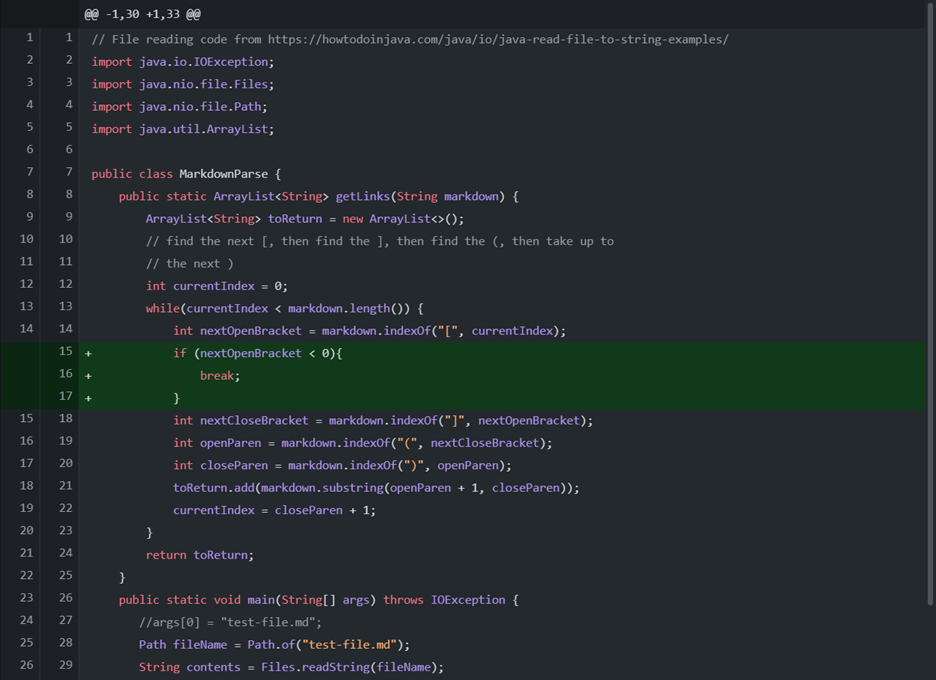
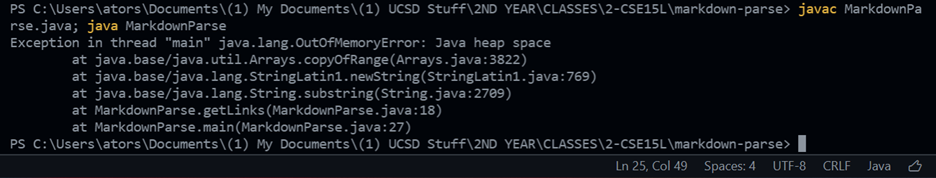
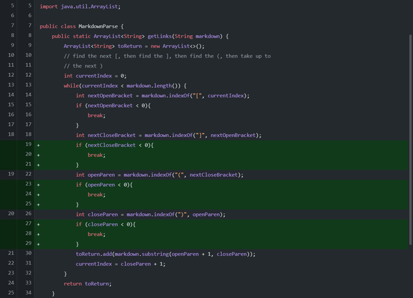
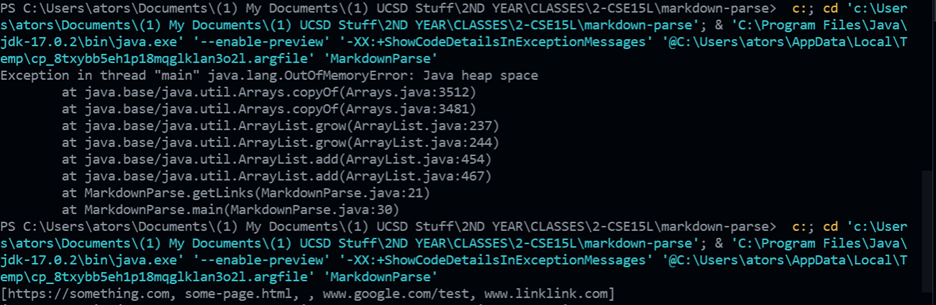
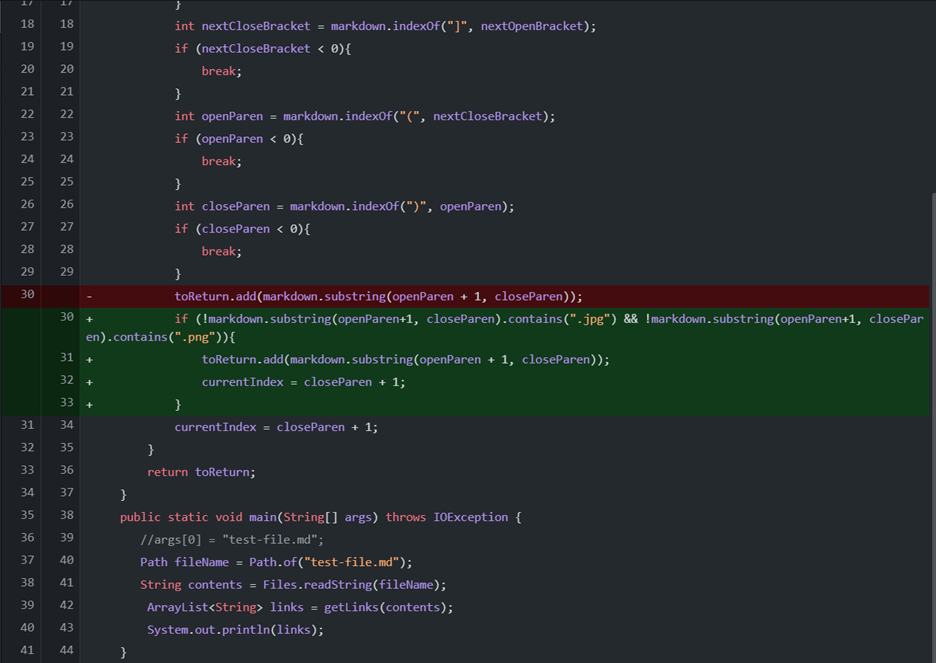
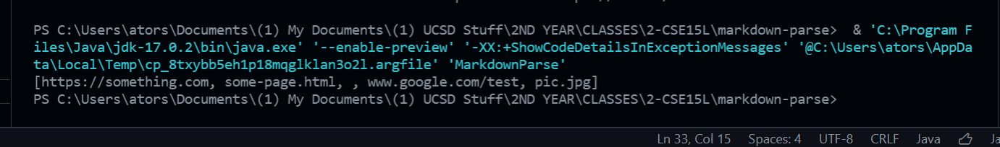

# **Lab Report 2**
### **Debugging step #1**
Github Diff:

[Failiure-Inducing Input]()

Symptom:

Write here....

### **Debugging step #2**
Github Diff:

[Failiure-Inducing Input]()

Symptom:

Write here....

### **Debugging step #2**
Github Diff:

[Failiure-Inducing Input]()

Symptom:

Write here....
