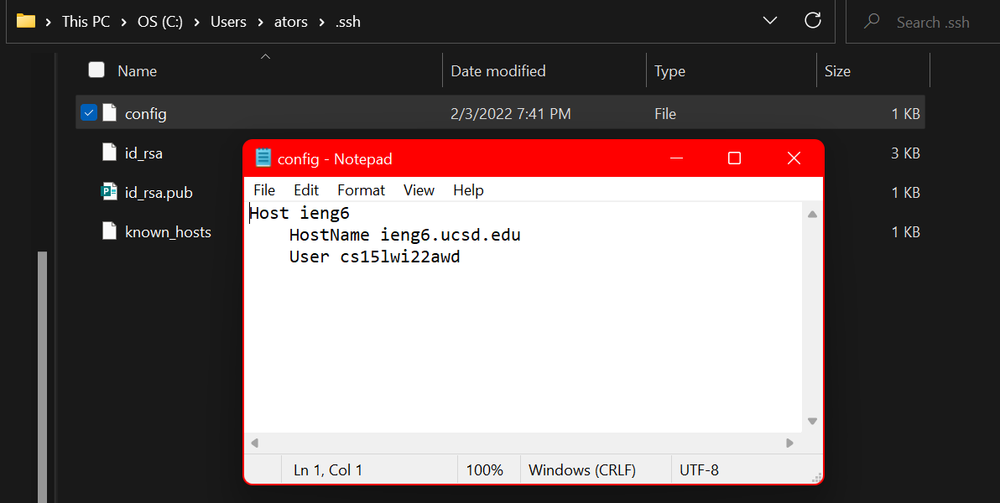
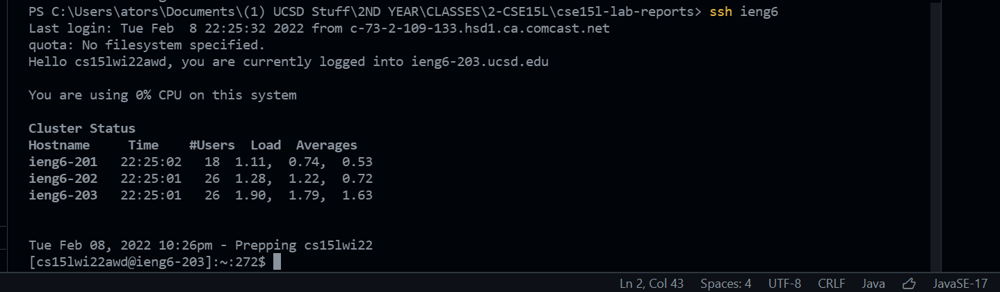
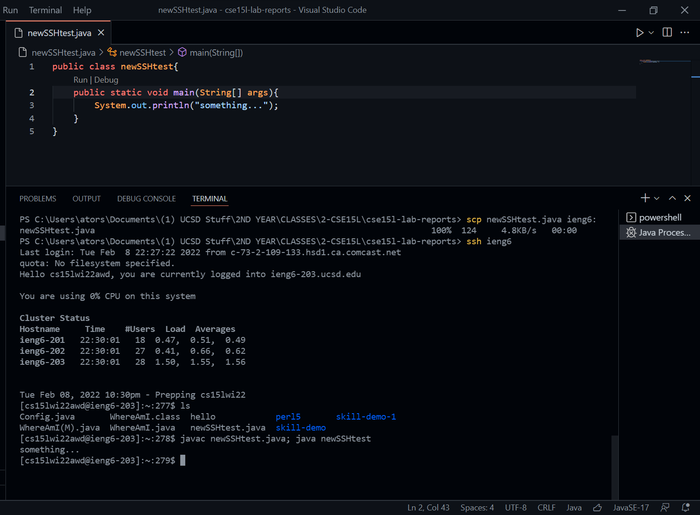

# **Lab Report 3**
### **Streamlining ssh Configuration**
### Step 1:
- In the directory that contains the *.ssh* folder on my computer, I opened a new file called "config" and used notepad to edit the file so that it the HostName is `ieng6.ucsd.edu`, User is my account name and I chose the alias to be *ieng6*
- This will make it so that ssh can automaticaly recognize ieng6 as ``cs15lwi22awd@ieng6.ucsd.edu`` and make logging in to the remote server much easier with much fewer keystrokes needed.  

### Step 2:
-  From now on, when we use the `ssh` command to log into the remote server, we can only use the alias I provided in the config file in the ssh.
- `ssh` will recognize it as being my specific account name when logging in from my device which has the config file. 

### Step 3:
- I created a new simple java file which prints out "something..." I used the the `scp` command to securely copy the file over to the home directory of the remote server
- Because, my full account name was given an alias in the config file, I was able to use the alias in `scp` command to be able to copy the file without typing in my entire username and host address. 

