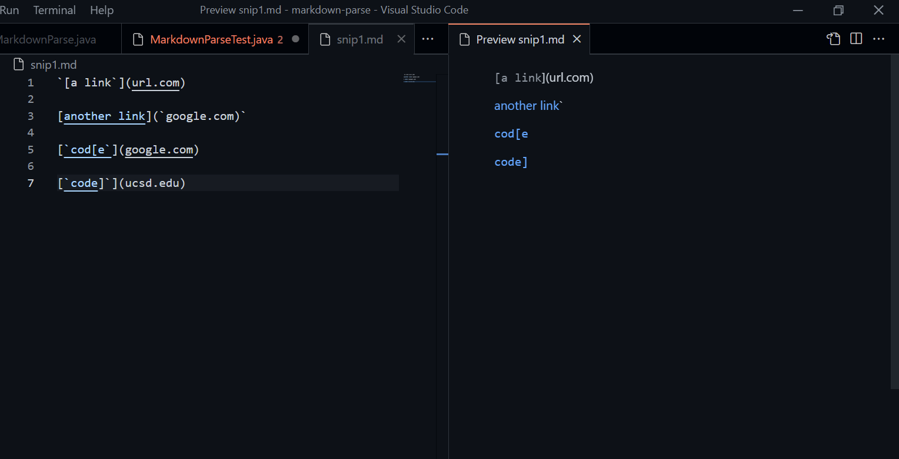
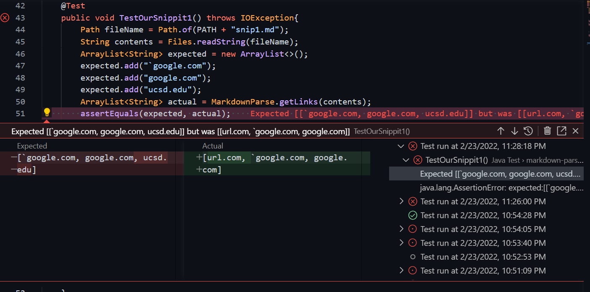
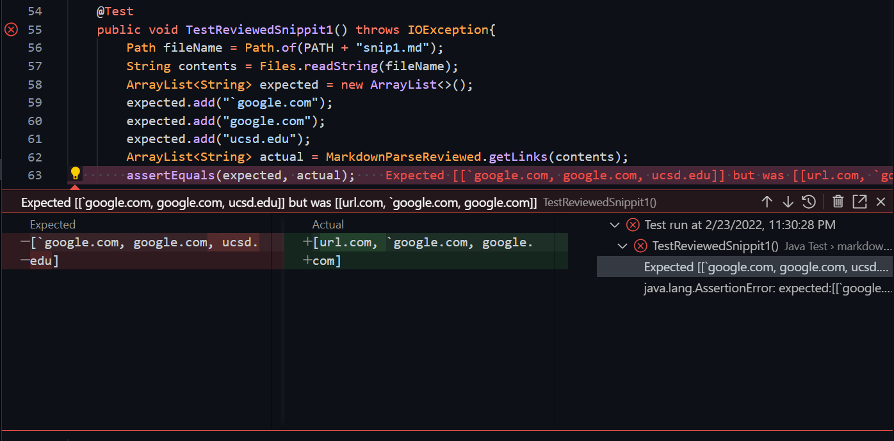
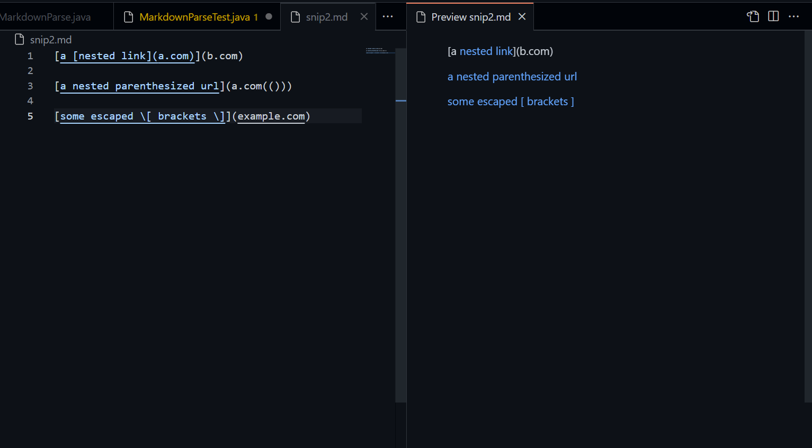
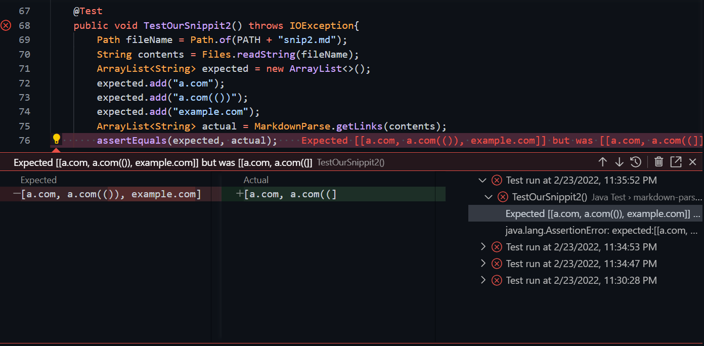
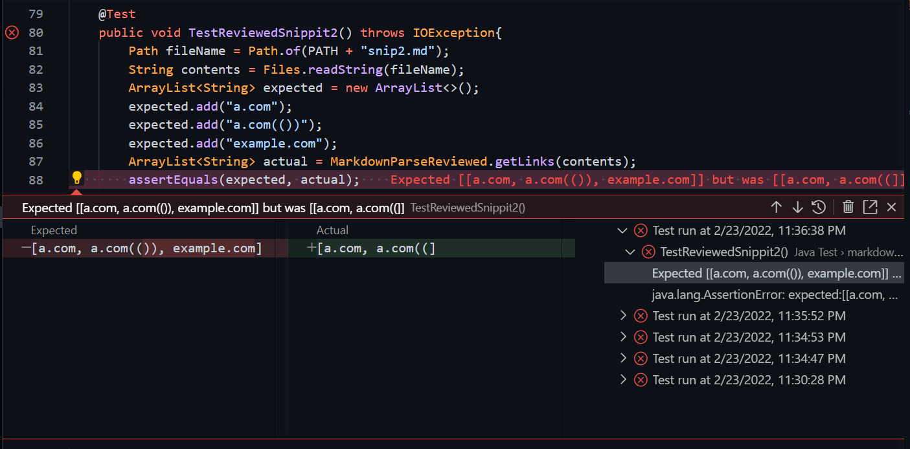
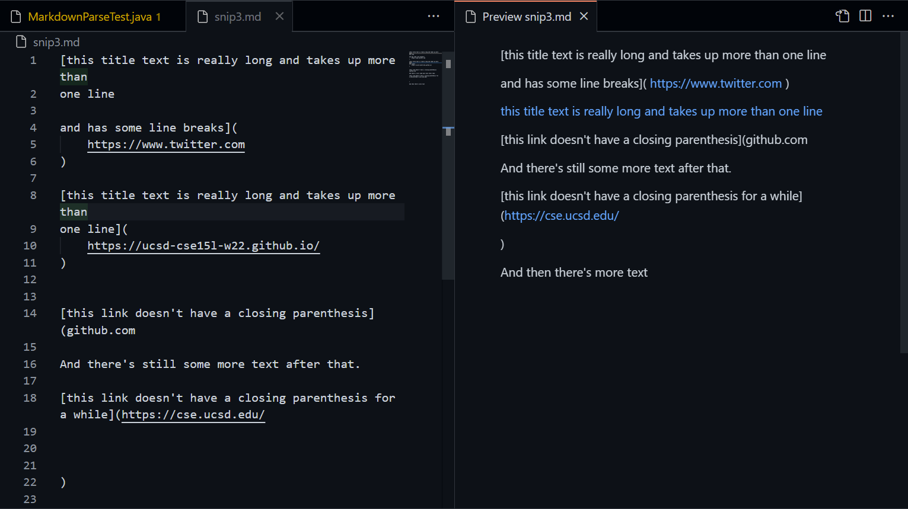
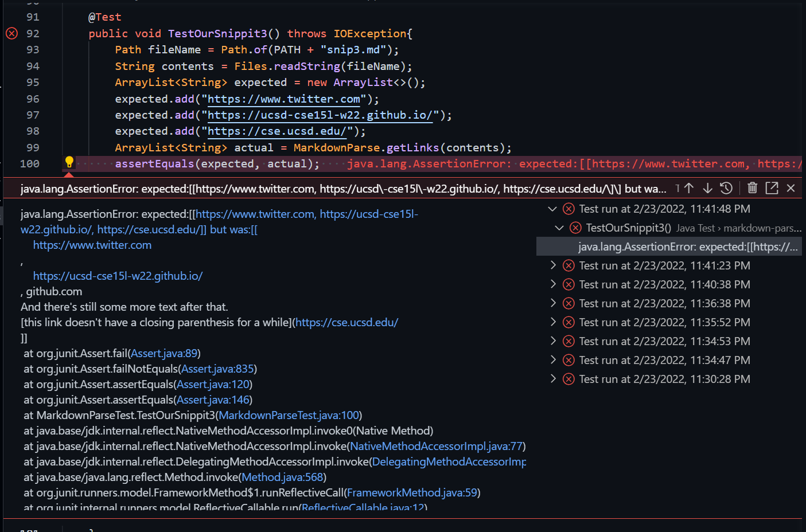
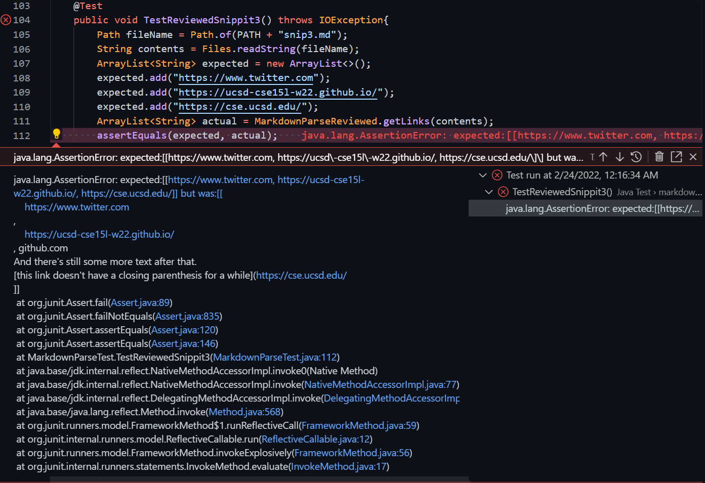

# **Lab Report 3**
### **Markdown Testing**

### Links:
[My Markdown Parse Repository](https://github.com/atorshizi/markdown-parse)

[Reviewed Markdown Parse Repository](https://github.com/clingunis/markdown-parse)

### Snippit 1:
Based on VScode's markdown viewer, I expect this test file should have the following three links: 
``` 
`google.com
google.com
ucsd.edu
```


I made two JUnit tests for this file (one for our implementation and one for the group we reviewed). The testing methods are as follows.

``` java
@Test
public void TestOurSnippit1() throws IOException{
    Path fileName = Path.of(PATH + "snip1.md");
	String contents = Files.readString(fileName);
    ArrayList<String> expected = new ArrayList<>();
    expected.add("`google.com");
    expected.add("google.com");
    expected.add("ucsd.edu");
    ArrayList<String> actual = MarkdownParse.getLinks(contents);
    assertEquals(expected, actual);
}

@Test
public void TestReviewedSnippit1() throws IOException{
    Path fileName = Path.of(PATH + "snip1.md");
	String contents = Files.readString(fileName);
    ArrayList<String> expected = new ArrayList<>();
    expected.add("`google.com");
    expected.add("google.com");
    expected.add("ucsd.edu");
    ArrayList<String> actual = MarkdownParseReviewed.getLinks(contents);
    assertEquals(expected, actual);
}
```
For our implementation, the JUnit test failed and this resulting output.


For the group that we reviewed, the JUnit test also failed with the following resulting output.



### Snippit 2:
Based on VScode's markdown viewer, I expect this test file should have the following three links: 
``` 
a.com
a.com(())
example.edu
```


I made two JUnit tests for this file (one for our implementation and one for the group we reviewed). The testing methods are as follows.

``` java
@Test
public void TestOurSnippit2() throws IOException{
    Path fileName = Path.of(PATH + "snip2.md");
	String contents = Files.readString(fileName);
    ArrayList<String> expected = new ArrayList<>();
    expected.add("a.com");
    expected.add("a.com(())");
    expected.add("example.com");
    ArrayList<String> actual = MarkdownParse.getLinks(contents);
    assertEquals(expected, actual);
}

@Test
public void TestReviewedSnippit2() throws IOException{
    Path fileName = Path.of(PATH + "snip2.md");
	String contents = Files.readString(fileName);
    ArrayList<String> expected = new ArrayList<>();
    expected.add("a.com");
    expected.add("a.com(())");
    expected.add("example.com");
    ArrayList<String> actual = MarkdownParseReviewed.getLinks(contents);
    assertEquals(expected, actual);
}
```
For our implementation, the JUnit test failed and this resulting output.


For the group that we reviewed, the JUnit test also failed with the following resulting output.



### Snippit 3:
Based on VScode's markdown viewer, I expect this test file should have the following three links: 
``` 
https://www.twitter.com
https://ucsd-cse15l-w22.github.io/
https://cse.ucsd.edu/
```


I made two JUnit tests for this file (one for our implementation and one for the group we reviewed). The testing methods are as follows.

``` java
@Test
public void TestOurSnippit3() throws IOException{
    Path fileName = Path.of(PATH + "snip3.md");
    String contents = Files.readString(fileName);
    ArrayList<String> expected = new ArrayList<>();
    expected.add("https://www.twitter.com");
    expected.add("https://ucsd-cse15l-w22.github.io/");
    expected.add("https://cse.ucsd.edu/");
    ArrayList<String> actual = MarkdownParse.getLinks(contents);
    assertEquals(expected, actual);
}

@Test
public void TestReviewedSnippit3() throws IOException{
    Path fileName = Path.of(PATH + "snip3.md");
    String contents = Files.readString(fileName);
    ArrayList<String> expected = new ArrayList<>();
    expected.add("https://www.twitter.com");
    expected.add("https://ucsd-cse15l-w22.github.io/");
    expected.add("https://cse.ucsd.edu/");
    ArrayList<String> actual = MarkdownParseReviewed.getLinks(contents);
    assertEquals(expected, actual);
}
```
For our implementation, the JUnit test failed and this resulting output.


For the group that we reviewed, the JUnit test also failed with the following resulting output.
