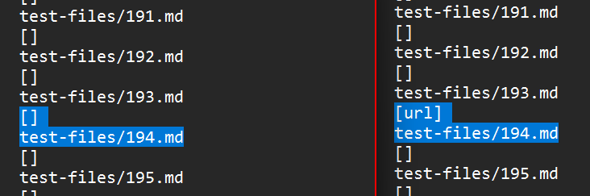
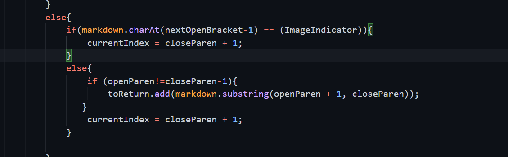
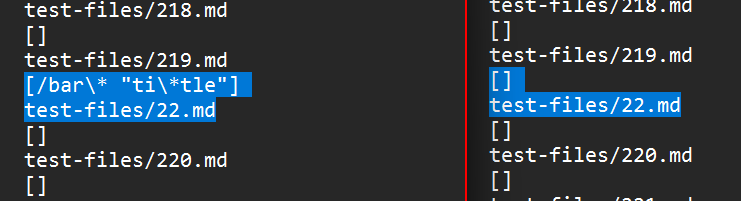
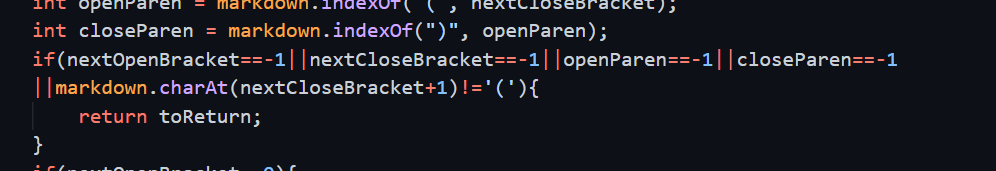

# **Lab Report 5**
### **Large-scale Testing**

To get the output for all the test files, I ran the provided script file while contains a for loop that runs each test and prints the results and test name and I stored the results in text files. Since my implementation had a bug where, if a link was split across two lines it would print the link in different lines which meant that the two result files did not match up line to line for each test and thus, the `diff ` command did not produce usable difference data. To find these differences I had to manually go through the two files and compare the outputs of each test with each other. 

### Problem 1:
Based on VScode's markdown viewer, I would expect the file *194.md* to have only the link `title (with parens)` however both implementations yeilded the incorrect outputs for this since the raw code is 
``` java
[Foo*bar\]]:my_(url) 'title (with parens)'

[Foo*bar\]]
```
and neither implementation gave the correct output as shown below (the left output is from my implementation):



There are characters after the closing brackets that causes my implementation of the code to disregard the potential link since, to pass a different test, we added a condition that the closing brackets and opening parenthesis must be consecutive. The bug therefore, is that my implementation should get rid of that condition to be able to pass this test. The part to remove can be seen in the following part of the code:



### Problem 2:
Based on VScode's markdown viewer, I would expect the file *22.md* to have only the link `ti*tle` however both implementations yeilded the incorrect outputs for this since the raw code is 
``` java
[foo](/bar\* "ti\*tle")
```
and there are backspace escapes that shouldn't be included as the URL. Neither implementations return an array with the expected URL; instead they returned the following (the output on the left is my implementation):



Therefore, both of these implementations are wrong. The bug in my implementation is that it doesn't check the substring for escapes before adding it to the array. This is a missing piece of code that needs to be added in the form of an extra if-else block that iterates through the substring that is the URL and splits it when it gets to a backslash escape substring and puts together the two parts together without the escape and if there is a `*` charcter it disregards the substring before it. This needs to be done before the string is added to the arrray and after the text between the parenthesis is identified in the following part of the code:


